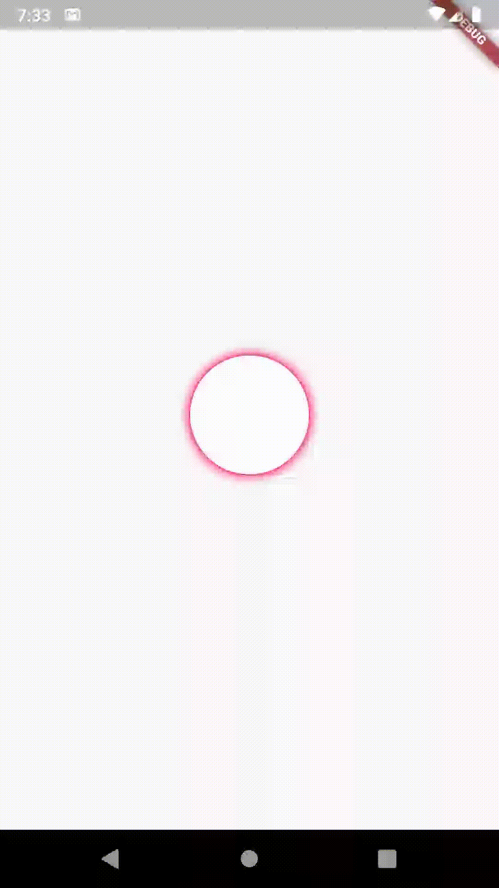
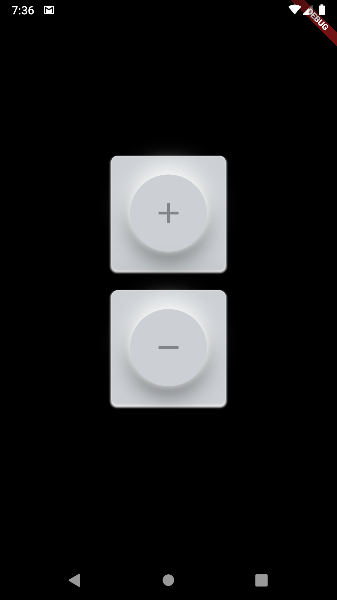

# Animation tutorial

This project is majorly to implement some awesome widgets or animations.

Welcome if you're interested at contributing.

## Widgets & Animations

1. Box shadow animation [Link](lib/src/anim/anim_shadow_box.dart)

2. Squishy toggle button (**WIP**) [Link](lib/src/anim/squishy_toggle_button.dart)

3. Galaxy [Link](lib/src/anim/galaxy.dart)

